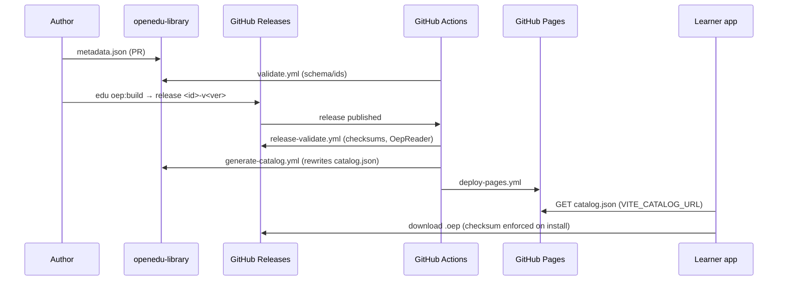

# Architecture

The OpenEdu Library is a **data + CI repository**. All registry logic lives in the
published `@open-edu/registry` package, which reuses `@open-edu/schemas` and
`@open-edu/oep-distribution`. Nothing here is recreated.

## Repository layout

```
openedu-library/
├── README.md
├── LICENSE
├── package.json              # ESM, Node 20+, one devDependency: @open-edu/registry
├── catalog.json              # GENERATED — never hand-edited
├── courses/
│   ├── tribal-art/           # metadata.json, README.md, thumbnail.png, screenshots/
│   └── science-grade7/
├── schemas/                  # GENERATED draft-07 JSON Schema files
├── scripts/
│   └── make-placeholder.js   # the only repo script (solid-color PNG thumbnails)
├── docs/
└── .github/workflows/
```

## Publishing sequence



## Install flow

1. Learner app fetches `catalog.json` (`CatalogPage`).
2. User installs a course via file, URL, or catalog.
3. For catalog installs, `catalogSource` carries the `expectedChecksum` from the
   catalog.
4. `InstallCoordinator` downloads the bytes, verifies the SHA-256 against
   `expectedChecksum` (`CHECKSUM_MISMATCH` on failure), then validates the package
   with `OepReader`.

## Update flow

1. The learner compares the installed version against
   `packages[].latestVersion`.
2. On update, it uses the catalog's newest `versions[]` entry (the list is sorted
   ascending, so the last element is the newest).

## Tooling

The `open-edu-registry` CLI (from `@open-edu/registry`) exposes:

| Command | Purpose | Used by |
| --- | --- | --- |
| `validate-metadata` | Schema-validate all `courses/*/metadata.json`, check unique ids | `validate.yml` |
| `validate-catalog` | Validate `catalog.json` against `CatalogSchema` + ordering rules | `validate.yml` |
| `generate-catalog` | Merge metadata + GitHub Releases into `catalog.json` | `generate-catalog.yml` |
| `validate-release` | Verify a release's tag, metadata, assets, checksums, and OEP manifest | `release-validate.yml` |
| `generate-schemas` | Emit `schemas/*.json` from the Zod schemas | maintainers |

The logic (metadata loading, GitHub API client, catalog builder, release
validation, checksum computation via `computeSha256`, package inspection via
`OepReader`) is implemented in `@open-edu/registry` and its dependencies — this
repository only invokes it.

## Security model

- **SHA-256 is authoritative.** The generator computes the checksum from the
  downloaded asset; `checksums.txt` is cross-checked (a mismatch is a warning at
  generation time, a hard failure at release-validation time).
- **Install-time verification.** The learner verifies the downloaded file's
  checksum against the catalog before installing.
- **Metadata is schema-validated.** Unknown fields are rejected; duplicate ids are
  impossible.
- **Package integrity.** Every released `.oep` is opened with `OepReader`
  (ZIP security, manifest validation, id/version cross-check).
- No `.oep` files are ever committed to the repository.

## Extensibility

- **Multiple registries**: nothing ties a learner to one catalog — point
  `VITE_CATALOG_URL` at any conforming catalog.
- **Signatures**: `.sig` assets are reserved in the release naming convention.
- **Additive schema fields**: `CatalogSchema` and `RegistryMetadataSchema` are
  backward compatible; new optional fields propagate automatically.
