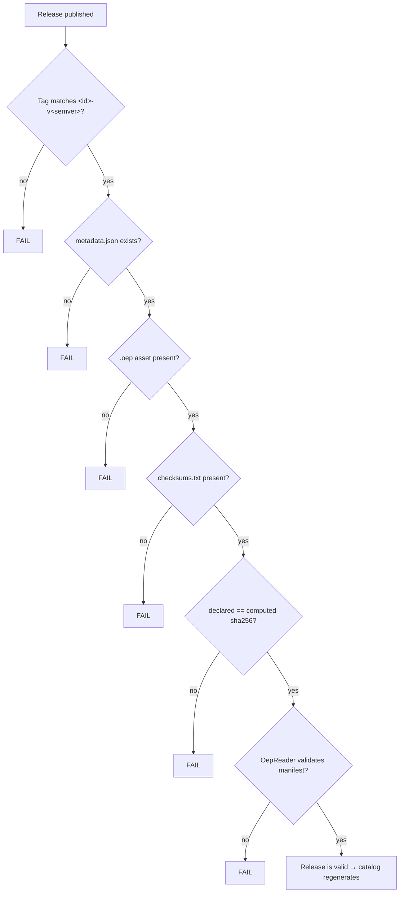

# Release Process

Course releases are hosted as GitHub Releases. Naming and content are enforced by
`release-validate.yml` on every published release.

## Naming convention

| Component | Format | Example |
| --- | --- | --- |
| Release tag | `<id>-v<major>.<minor>.<patch>` | `tribal-art-v0.4.0` |
| `.oep` asset | `<id>-<version>.oep` | `tribal-art-0.4.0.oep` |
| Checksums asset | `checksums.txt` | lines of `<sha256>  <filename>` |
| Future signature | `<id>-<version>.oep.sig` | reserved |

Tag → `(id, version)` parsing regex: `^(.+)-v(\d+)\.(\d+)\.(\d+)$`.

## Required assets

Every release **must** contain:

1. `<id>-<version>.oep` — the course package
2. `checksums.txt` — SHA-256 of every `.oep` asset

## What CI enforces

`release-validate.yml` runs `open-edu-registry validate-release`, which:

1. parses the tag and checks `courses/<id>/metadata.json` exists and is valid
2. downloads the `.oep` asset and **computes** its SHA-256
3. cross-checks it against `checksums.txt`
4. runs the framework's `OepReader.inspect` on the downloaded bytes — the exact
   same reader the learner app uses — and verifies the manifest id/version match
   the release

## Versioning policy

- **Patch** (`1.2.0` → `1.2.1`): upload a new release; no metadata or catalog
  edits needed.
- **Minor/major**: new release; `latestVersion` updates automatically.
- The catalog always lists **all** published versions, sorted ascending.
- Pre-releases are excluded from the catalog by default.

## Deprecation

Removing a course: delete its releases and its `courses/<id>/` directory in a PR.
The next catalog regeneration omits it.
